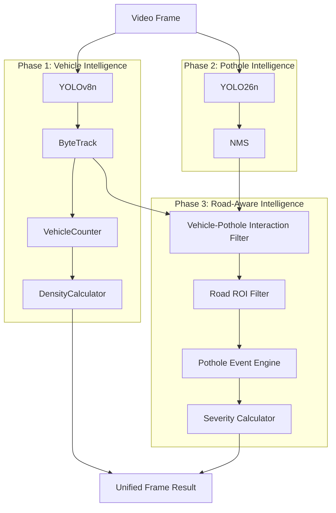

# Urban Watch — Phase 3 Architecture
## Multi-AI Integration & Road-Aware Pothole Intelligence

This document outlines the architecture for integrating Phase 1 (Vehicles) and Phase 2 (Potholes) into a Unified Intelligence Pipeline.

### 1. Existing Foundation
- **Phase 1 (Vehicles)**: Uses `YOLOv8n` + `ByteTrack` + `VehicleCounter` + `DensityCalculator` via `VideoProcessor` (`backend/video/processor.py`).
- **Phase 2 (Potholes)**: Uses `YOLO26n` + `NMS Deduplication` + `PotholeEventTracker` (`backend/ai/pothole/detector.py`, `tracker.py`).

### 2. Unified Pipeline Architecture (`backend/ai/unified/`)

The unified pipeline will process each video frame sequentially, fusing spatial and temporal intelligence.

### 3. Key Components

#### A. Unified Video Processor (`backend/ai/unified/processor.py`)
A new class `UnifiedVideoProcessor` that instantiates both the vehicle YOLO and pothole YOLO models. It manages the frame iteration and passes data through the fusion layers.

#### B. Vehicle-Pothole Interaction Suppressor (`backend/ai/unified/interaction.py`)
Addresses FP-09 (Vehicle Undercarriage Shadows).
- Input: Active vehicle tracks + Raw pothole detections.
- Logic: If a pothole detection heavily overlaps (high IoU) with a moving vehicle's bounding box, it is marked as `status = "suppressed" (vehicle_shadow_candidate)`.

#### C. Road ROI Filter (`backend/ai/unified/roi.py`)
Addresses spatial context.
- Input: Pothole bounding boxes + Configured camera polygon.
- Logic: If a pothole center falls outside the polygon, it is marked as `status = "outside_road_roi"`.

#### D. Pothole Event Engine & Severity (`backend/ai/unified/events.py`)
Upgrades the `PotholeEventTracker` to include measurable severity.
- **Severity Metrics**: Based purely on image-space bbox area, tracking persistence, and maximum confidence. Categories: `LOW`, `MEDIUM`, `HIGH`. (No physical depth estimation).
- **Status lifecycle**: `candidate` → `confirmed` → `resolved`.

### 4. API & Schemas (`backend/api/routes_unified.py`)

New schemas in `backend/ai/unified/schemas.py`:
- `UnifiedFrameAnalysis`
- `UnifiedVehicle`
- `UnifiedPothole`
- `UnifiedPotholeEvent`

New API Endpoints (Preserving original endpoints):
- `POST /api/ai/unified/process/{video_id}`
- `GET /api/ai/unified/status/{video_id}`
- `GET /api/ai/unified/results/{video_id}`

### 5. Frontend Integration
- **`index.html`**: Add pothole statistics panels (Active Events, Confirmed Potholes, Suppressed Noise, Highest Severity).
- **`overlay.js`**: Unified drawing loop supporting both vehicle tracks (blue/green) and pothole bounding boxes (red/orange) with severity labels.
